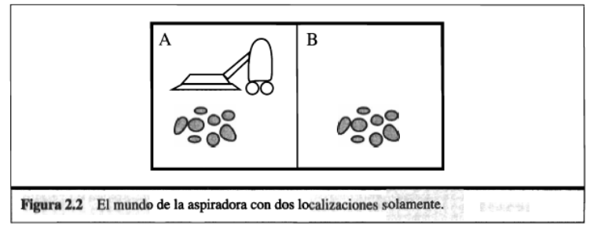
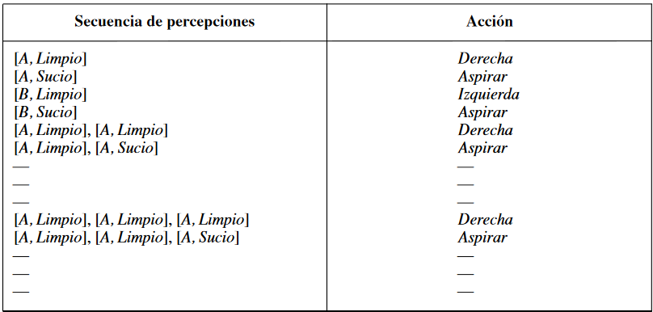

# Parte 2: Lógica e inteligencia artificial.

## Práctica 5:

1. Defina
    1. Inteligencia

        Es la facultad de la mente que permite aprender, entender, razonar, tomar decisiones y formarse una idea determinada de la realidad.

    2. Inteligencia Artificial

        Hay muchas definiciones, pero podemos definirla como una mezcla entre sistemas que piensan como humanos, sistemas que piensan racionalmente, sistemas que actúan como humanos y sistemas que actúan racionalmente.

2. Lea el artículo original de Turing sobre IA (Turing, 1950). En él se comentan algunas objeciones potenciales a su propuesta y a su prueba de inteligencia ¿Cuáles de estas objeciones tiene todavía validez? ¿Son válidas sus refutaciones? Se le ocurren nue vas objeciones a esta propuesta teniendo en cuenta los desarrollos realizados desde que se escribió el artículo? En el artículo, Turing predijo que para el año 2000 sería probable que un computador tuviera un 30 por ciento de posibilidades de superar una Prueba de Turing dirigida por un evaluador inexperto con una duración de cinco minutos ¿Considera razonable lo anterior en el mundo actual? ¿Y en los próximos 50 años?

    El argumento teológico ya casi no tiene validez. El argumento del avestruz es todavía esgrimido por muchas personas. La objeción matemática sigue válida hasta nuestros días y, si bien se han resulto muchos problemas a los que antes no existía solución alguna, aun queda mucho en el tintero. El argumento de la consciencia sigue teniendo validez: las máquinas no se sienten tristes o felices. El argumento de incapacidades esta limitado a pocos aspectos: las máquinas, por ejemplo, tienen sentido del humor. El argumento de Lady Lovelace ya no es válido: hay máquinas diseñadas para crear que van más allá de lo que fueron programadas. El argumento de la continuidad del sistema nervioso no es válido ya que se pueden crear máquinas que tengan un índice de error. El argumento de la informalidad del comportamiento tampoco es ya válido: los autómatas que usan machine learning van más allá cada día y llegan cada vez más lejos. Acerca del argumento de la percepción extra-sensorial, ha sido desmentido y desacreditado muchas veces y ya no tiene ninguna validez.  
    Excepto la última, todas son válidas. Acerca de lo de la prueba de Turing, actualmente no creo que sea posible, probablemente en 50 años sí.

3. Consulte en la literatura existente sobre la IA si alguna de las siguientes tareas se puede efectuar con computadores:

    1. Jugar una partida de tenis de mesa (ping-pong) decentemente.

        Es posible.

    2. Conducir un coche en el centro de El Cairo.

        Es posible.

    3. Comprar comestibles para una semana en el mercado.

        Es posible.

    4. Comprar comestibles para una semana en la web.

        Es posible.

    5. Jugar una partida de bridge decentemente a nivel de competición.

        Es posible.

    6. Descubrir y demostrar nuevos teoremas matemáticos.

        Actualmente, no conozco ningún caso. No estoy seguro si fuera posible o no.

    7. Escribir intencionadamente una historia divertida.

        No es posible ya que las máquinas no tienen intenciones. Son mecánicas.

    8. Ofrecer asesoría legal competente en un área determinada.

        Es posible.

    9. Traducir ingles hablado al sueco hablado en tiempo real.

        Es posible.

    10. Realizar una operación de cirugía compleja.

        No es posible por si solo. Pero si como auxiliar a una persona.

En el caso de las tareas que no sean factibles de realizar en la actualidad, trate de describir cuáles son las dificultades y calcule para cuando se podrán superar.

4. Defina los siguientes términos: agente, función de agente, programa de agente, racionalidad, autonomía, agente reactivo, agente basado en modelo, agente basado en objetivo, agente basado en utilidad, agente que aprende.

* Agente: es algo que razona. De los agentes informáticos se espera que tengan otros atributos que los distingan de los «programas» convencionales, como que estén dotados de controles autónomos, que perciban su entorno, que persistan durante un período de tiempo prolongado, que se adapten a los cambios, y que sean capaces de alcanzar objetivos diferentes.
* Función de agente: es una descripción matemática abstracta; el programa del agente es una implementación completa, que se ejecuta sobre la arquitectura del agente.
* Programa de agente: es aquello que implementa la función del agente que proyecta las percepciones en las acciones.
* Racionalidad: es la actitud del que actúa de acuerdo con la razón y no se deja llevar por sus impulsos.
* Autonomía: facultad de la persona o la entidad que puede obrar según su criterio, con independencia de la opinión o el deseo de otros.
* Agentes reactivos: son aquellos agentes que seleccionan las acciones sobre la base de las percepciones actuales, ignorando el resto de las percepciones históricas.
* Agente basado en modelo: es aquel agente que selecciona sus acciones basándose en «cómo funciona el mundo», tanto si está implementado con un circuito booleano simple o con teorías científicas completas.
* Agente basado en utilidad: es aquel agente racional que debe se comporta de acuerdo a una función de utilidad cuyo valor esperado debe maximizar.
* Agente que aprende: es aquel agente que posee dos elementos importantes: el de aprendizaje y el de actuación. El primero está responsabilizado de hacer mejoras y el segundo se responsabiliza de la selección de acciones externas.

5. Defina una función que determine la medida de rendimiento para el ambiente de la aspiradora descripto en la figura 2.2 del libro “Inteligencia Artificial...”

    

    La implementación debe ser modular de forma que los sensores y actuadores y las características del entorno (tamaño, forma y localización de la suciedad) puedan modificarse fácilmente. _Nota: hay implementaciones disponibles en el repositorio de internet que pueden ayudar a decidir que lenguaje de programación usar._

    

6. Examine ahora la racionalidad de varias funciones de agentes aspiradora.

    1. Muestre que la función de agente aspiradora descrita en la Fig. 2.3 es realmente racional bajo la hipótesis presentada en la sección 2.2 de buen comportamiento.

        

    2. Describa una función para un agente racional cuya medida de rendimiento modificada deduzca un punto para cada movimiento. ¿Requiere el programa de agente estado interno?
    3. Discuta posibles diseños de agentes para los casos en los que las cuadriculas limpias puedan ensuciarse y la geografía de medio sea desconocida. ¿Tiene sentido que el agente aprenda de su experiencia en estos casos? ¿Si es así, que debe aprender?