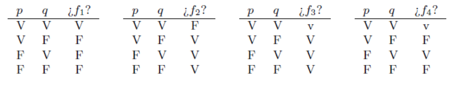

# Parte 2: Lógica e inteligencia artificial.

## Práctica 2:

1. Retome el Ejercicio 1 de la Práctica 1:

    1. Seleccione un par de enunciados que sean lógicamente equivalentes(que tengan el mismo significado). Demuéstrelo mediante tablas de verdad.

        Enunciados 2 y 4. Ambos siguen la estructura (p → q). Su tabla de verdad es la siguiente:

        (p | → | q)
        :---:|:---:|:---:
        V | V | V
        F | V | V
        V | F | F
        F | V | F

    2. Para el ítem ii, construya dos enunciados que sean lógicamente equivalentes.

        Dos ejemplos son (⌐p ⋁ q) y (⌐q → ⌐p).

    3. Para el ítem vii, construya dos enunciados que sean lógicamente equivalentes.

        Siguiendo la lógica de arriba, dos ejemplos son (⌐((p ⋀ q ⋀ r) ⋁ (q ⋀ s)) ⋁ t) y (⌐t → ⌐((p ⋀ q ⋀ r) ⋁ (q ⋀ s))).

2. Fundamentar:

    1. Si v(A ⋀ B) = F y v(A ⋁ B) = V entonces v(A) = v(⌐B)?

        Esto es verdadero y se puede pensar de la siguiente forma:
        1. Si v(A ⋀ B) = F, entonces hay que pensar en las combinaciones VF, FV y FF.
        2. Dado que v(A ⋁ B) = V, es que pueden darse las combinaciones VV, FV y VF.
        3. La intersección de lo anterior nos dice que estamos hablando de las combinaciones FV o VF o, en otras palabras, que cuando A es verdadero, B es falso y viceversa.
        4. Se concluye que v(A) = v(⌐B) es verdadero.

    2. Si v(A → B) = F y v(A ⋁ B) = V entonces v(A) = v(⌐B)?

        También es verdadero. La forma de pensarlo es similar al inciso anterior:
        1. Si v(A → B) = F, entonces hay que pensar en la combinación VF.
        2. Dado que v(A ⋁ B) = V, es que pueden darse las combinaciones VV, FV y VF.
        3. La intersección de lo anterior nos dice que estamos hablando de la combinación VF o, en otras palabras, que cuando A es verdadero, B es falso.
        4. Se concluye que v(A) = v(⌐B) es verdadero.

    Nota: v es una función de valuación.

3. Para las tablas dadas a continuación, encontrar alguna fbf de la Lógica de Enunciados que las tenga por tablas de verdad.

    _Ayuda: alcanza con usar p, q, ⋁, ⋀, ⌐_

    

    La primera tabla representa (p ⋁ q); la segunda, ⌐(p ⋁ q); la tercera, ⌐(p ⋁ q) ⋁ (p ⋁ q); y la cuarta, ⌐(p ⋀ q) ⋁ ⌐(p ⋀ q).

4. Sean A, B, C y D formas enunciativas. Se sabe que A → B es una contradicción y que C → D es una tautología. Determinar, si es posible, cuáles de las siguientes formas enunciativas son tautologías y cuáles contradicciones. Justificar las respuestas.

    1. (C → B) ⋁ (D → B)

        Pueden darse las combinaciones VF VF, VF FF, FF VF y FF FF. La primera combinación dará falso; cualquiera de las otras tres restantes, verdadero.

    2. (A → C) ⋁ (B → D)

        En este caso, estamos ante una tautología. Pueden darse los casos VV FV, VV FF, VF FV y VF FF. Cualquiera de los casos es verdadero.

    3. (A → D) ⋀ (B → D)

        Acá se dan las combinaciones VV FV y VF FF. La primera combinación es verdadera; la segunda, falsa.