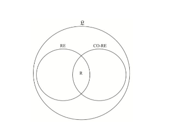

# COMPUTABILIDAD(clases 1 a 4)

* Problemas de decisión y búsqueda.

    Un problema es de decisión si la respuesta que se busca es sí o no, true o false. Un problema es de búsqueda si lo que se busca es encontrar algo: puede ser un camino, un número, etc. Por ejemplo, si yo quiero saber si existe un camino del vértice 1 al vértice N es un problema de decisión, a mi me interesa conocer si el camino existe o no. Ahora bien, si quiero conocer cuál es ese camino, entonces sí es un problema de búsqueda.

* MT que aceptan lenguajes, computan funciones y enumeran lenguajes.

    Hay tres visiones de MT:

    + MT calculadora: es aquella MT que produce o calcula una solución. Ej: si lo que necesito es obtener un camino de un vértice a al vértice b, voy a usar este tipo de máquina. 
    + MT reconocedora: es aquella que produce únicamente la respuesta sí o no ante una instancia. Ej: si lo que necesito es saber si existe un camino de un vértice a al vértice b, voy a usar este tipo de máquina.
    + MT generadora: es aquella que resuelve un problema generando todas sus instancias positivas. Si lo que necesito, por otra parte, es obtener todas los caminos desde el vértice a al vértice b, entonces voy a usa este tip de máquina. Diferénciese este tipo de MT de la calculadora en que la calculadora calcula solo una solución, la MT generadora genera todas las soluciones al problema.

* Tesis de Church-Turing.

    Todo lo computable puede ser llevado a cabo por una máquina de Turing.

* Construcción de MT.

    Una MT está compuesta por:
    + Una cinta infinita en los dos extremos, dividida en celdas. Cada celda puede almacenar un número.
    + Una unidad de control. En todo momento, la unidad de control almacena el estado corriente de M.
    + Un cabezal. En todo momento, el cabezal apunta a una celda. El símbolo apuntado se denomina símbolo corriente. El cabezal puede moverse solo de a una celda por vez, a la izquierda o a la derecha.

    A su vez, una MT representa 6-tupla(Q, Ʃ, Γ, δ, q₀, F), tal que:
    + Q es el conjunto de estados de M.
    + Ʃ es el alfabeto de las entradas de M.
    + Γ es el alfabeto de las cadenas de la cinta de M. Por convención, B ∈ (Γ – Ʃ).
    + δ es la función de transición de M. Se define δ: Q x Γ → Q x Γ x {L, R, S}, tal que L representa el movimiento del cabezal a la izquierda; R, el movimiento a la derecha; y S, que el cabezal no se mueve.
    + q₀ es el estado inicial de M.
    + F es el conjunto de estados finales de M.

* Equivalencia de modelos de MT.

    Dos modelos de MT son equivalentes cuando para toda MT M1 de un modelo existe una MT M2 equivalente del otro, es decir que L(M1)=L(M2).

* Jerarquía de la computabilidad. Relaciones entre sus clases.

    + RE: un lenguaje es recursivamente enumerable si y solo si existe una MT que lo reconoce. De esta manera, dado L ∈ RE, si M es una MT tal que L(M) = L, se cumple para toda cadena w de Ʃ* que:
        - Si w ∈ L, entonces M a partir de w se detiene en su estado qₐ.
        - Si w ∉ L, entonces M a partir de w se detiene en su estado qᵣ o no se detiene.
    + R: un lenguaje es recursivo si y solo si existe una MT M que lo reconoce y se detiene cualquiera sea su entrada. Ahora, dado L ∈ R, si M es una MT tal que L(M) = L, se cumple para toda cadena w de Ʃ* que:
        - Si w ∈ L, entonces M a partir de w se detiene en su estado qₐ.
        - Si w ∉ L, entonces M a partir de w se detiene en su estado qᵣ.

    Se cumple por definición que R ⊆ RE ⊆ ℒ. Puede demostrarse, además que R ⊆ RE ⊆ ℒ
    + CO-RE: clase conformada por lenguajes complemento, con respecto a Ʃ*, de los lenguajes recursivamente enumerables. Formalmente: CO-RE = {L | L ∈ ℒ ∧ Lᶜ ∈ RE}.

    

    De la figura, se desprende que un lenguaje L es recursivo si y sólo si tanto L como Lᶜ son recursivamente enumerables, lo que se prueba a continuación.  
    Así mismo, también se distinguen cuatro categorías de lenguajes. De acuerdo a su dificultad creciente, son:

    1. R.
    2. RE - R.
    3. CO-RE - R.
    4. ℒ - (RE U CO-RE).

    En tal contexto, dado un par cualquiera de lenguajes L y Lᶜ, se cumple que:

    + Tanto L como Lᶜ pertenecen a R.
    + L pertenece a RE - R, y Lᶜ pertenece a CO-RE - R.
    + Tanto L como Lᶜ pertenecen a ℒ - (RE U CO-RE).

    Lenguaje de RE-R: halting problem, lenguaje universal.
    Lenguaje de ℒ - (RE U CO-RE): lenguaje de Gödel. LƩ*

* Propiedades de clausura de R y RE.

    + R: cerrada a las operaciones de complemento, intersección, unión y concatenación.
    + RE: cerrada a las operaciones de intersección unión y concatenación. No es cerrada con respecto al complemento.

* Cómo burlar a las MT con espacio acotado y movimientos limitados.

    En concreto, esta es una forma de "burlar" el halting problem. La idea es limitar el espacio y acotar los movimientos estableciendo un límite de celdas que recorre el cabezal(digamos 20, pero puede ser cualquier número). Ahora bien, esta máquina, a diferencia de la del halting problem, si pertenece a R, pero sigue sin resolver el problema completo. 

* Cómo burlar al infinito recorriendo adecuadamente las cadenas de un lenguaje o ejecutando en un orden correcto las MT.

    Esta es otra manera de "burlar" al halting problem. En este caso, la idea es loopear hasta cierto punto, es decir, establecer un límite de pasos. De esta manera, la máquina, o acepta o rechaza, necesariamente, lo cual hace que pertenezca a R.

* Reducciones de problemas. Propiedades.

    Sean dos lenguajes L₁ y L₂ incluídos en Ʃ*. Existe una redución del lenguaje L₁ al lenguaje L₂, si y sólo si existe una función total computable f: Ʃ* → Ʃ* tal que ∀ w ∈ Ʃ*: w ∈ L₁ ↔ f(w) ∈ L₂. La función f se denomina función de reducción. Que f sea total computable significa, como se indicó previamente, que existe una MT que a partir de cualquier cadena w computa f(w) en su cinta de salida y se detiene. Que haya una reducción de L₁ a L₂ significa, entonces, que existe una MT que transforma toda cadena de L₁ en una cadena de L₂, y toda cadena no perteneciente a L₁ en una cadena no perteneciente a L₂. Todas las reducciones son reflexivas y transitivas, no así simétricas. Una reducción de L₁ a L₂ prueba que L₂ es tan o más difícil que L₁.

* Uso de las reducciones para probar pertenencia o no pertenencia a R y RE.

    La idea en estos casos es usar la premisa de "tan difícil", es decir, si reduzco de L₁ a L₂ y supongo que L₂ pertenece a R/RE, entonces L₁ pertenecerá a R/RE, respectivamente, siguiendo el razonamiento de que L₂ debe ser necesariamente tan difícil como L₁.

* MT restringidas.

    Son los llamados autómatas finitos. Estos se caracterizan por tener una sola cinta y que ésta sea de solo lectura. El cabezal se mueve solo a derecha. Hay uno o más estados de aceptación, también llamados estados finales. Cuando el cabezal llega al blanco de la derecha del input, el AF para(acepta si y sólo si el estado es final). Los autómatas finitos son ampliamente utilizados en los compiladores, inspectores de código y verificación automática de programas.
    
# COMPLEJIDAD COMPUTACIONAL(clases 5 a 7)

* MT que trabajan en tiempo T(n). Clases TIME(T(n)).

    Que una MT M trabaje en tiempo T(n) significa que, para toda entrada w, con |w|=n, M hace a lo sumo T(n) pasos, en su única computación si es determinística, o en cada una de sus computaciones si es no determinística. De modo similar se define una MT que trabaja en tiempo O(T(n)). Se asume que una MT hace siempre al menos n+ pasos, para leer toda su entrada.  
    Los problemas que pueden ser resueltos por MT M que trabajan en tiempo O(T(n)), se agrupan en una misma clase: un problema o lenguaje pertenece a la clase DTIME(T(n)) o NTIME(T(n)) si y solo si existe una MTD o MTN, respectivamente, con una o más cintas que lo resuelve o reconoce en tiempo O(T(n)).

* Las clases P, NP y EXP.

    La clase P agrupa a los problemas que se resuelven en tiempo determinístico polinomial, y NP es la clase de los problemas que se resuelven en tiempo no determinístico polinomial. EXP representa, a su vez, la clase de los problemas que se resuelven en tiempo exponencial.

* Tesis fuerte de Church-Turing.

    El overhead de un problema resolviendolo con cualquier modelo(ya sea MT o lambda-calculus, por ejemplo) es poly(n). Es decir, el modelo es independiente del algoritmo y eso hace que se cumple el overhead poly(n).

* Prueba de pertenencia a NP. Sospecha de no pertenencia a P. Sospecha de no pertenencia a NP.
* Reducciones polinomiales de problemas. Propiedades.
* Uso de las reducciones polinomiales para probar pertenencia o no pertenencia a P y NP.
* La clase NPC. Mecanismo para poblar NPC.
* La clase NPI.
* La clase CO-NP. Relación con NPC y NP.
* MT que trabajan en espacio S(n). Clases SPACE(S(n)).